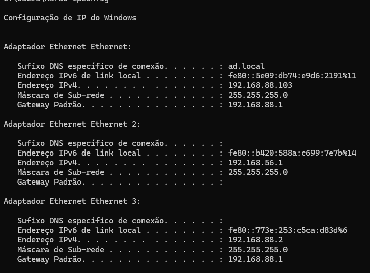
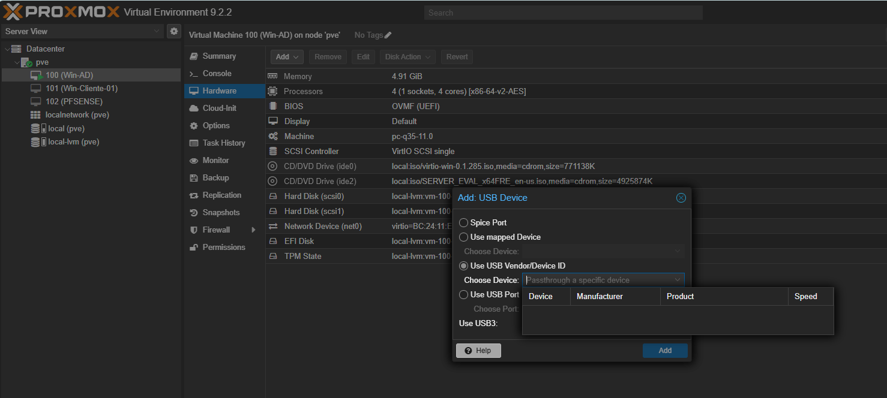
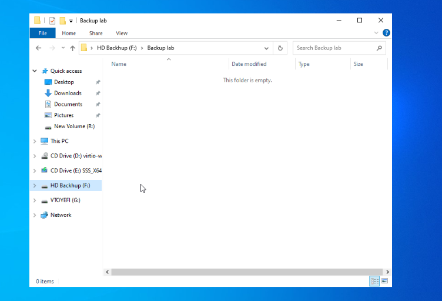
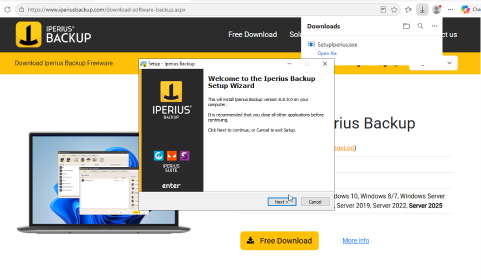
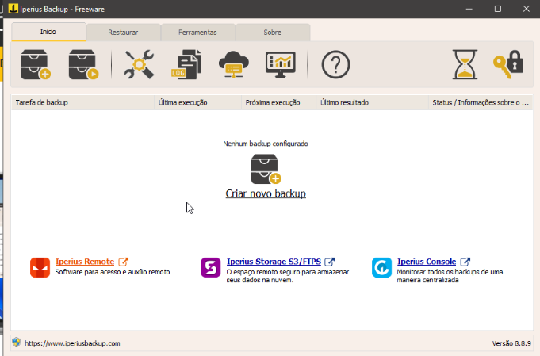
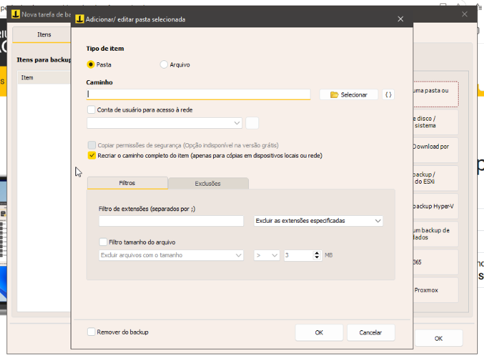
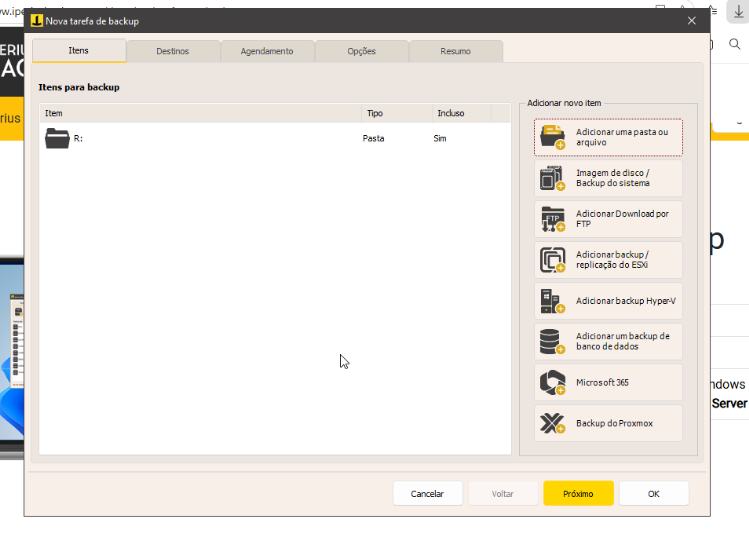
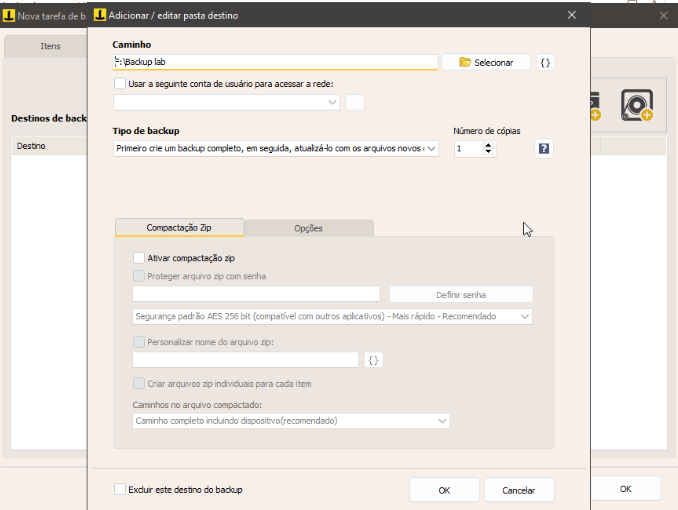
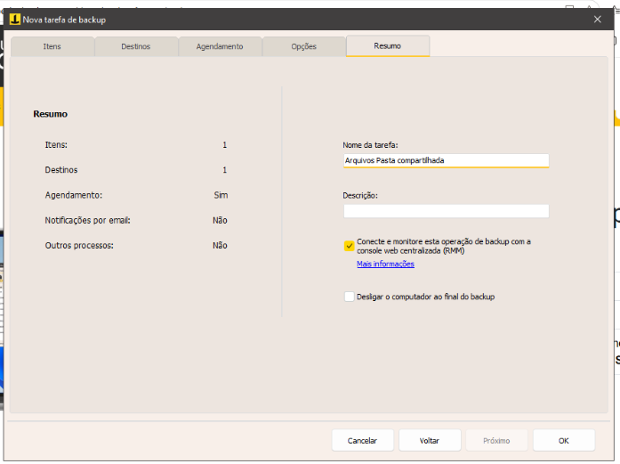
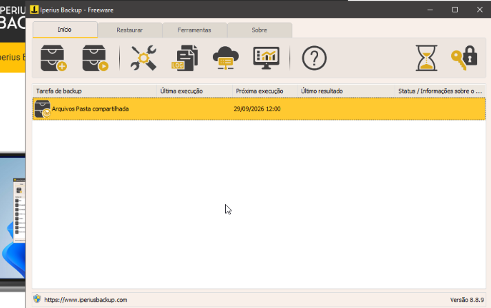

# Backup Server — Rotinas de Cópia de Segurança (Iperius Backup)

> Parte do laboratório Proxmox VE multi-nó em VirtualBox. Documenta a implementação de rotinas de backup para o [File Server](./DOC_VM_FileServer.md), utilizando **Iperius Backup**, com destino redundante (disco local + dispositivo externo via USB passthrough).

---

## Sumário

- [Visão Geral e Arquitetura](#visão-geral-e-arquitetura)
- [Topologia de Rede](#topologia-de-rede)
- [Mapeamento de Hardware: USB Passthrough](#mapeamento-de-hardware-usb-passthrough)
- [Instalação do Iperius Backup](#instalação-do-iperius-backup)
- [Configuração do Job de Backup](#configuração-do-job-de-backup)
- [Políticas de Segurança e Agendamento](#políticas-de-segurança-e-agendamento)
- [Notas / Observações Importantes](#notas--observações-importantes)

---

## Visão Geral e Arquitetura

Este documento detalha a implementação de rotinas de cópia de segurança para o laboratório de infraestrutura corporativa (Windows Server 2022 rodando em Proxmox VE).

> **Nota de arquitetura:** devido a limitações de recursos de hardware (RAM e processamento) no ambiente de virtualização, não foi provisionado um servidor dedicado exclusivamente para backup — decisão de compromisso, não o ideal. O Iperius Backup foi instalado no mesmo servidor multi-role ([Win-AD](./DOC_VM_Win-AD_Active-Directory.md)) que já centraliza **AD DS**, **DNS**, **DHCP** e **File Server**. Em um cenário com mais recursos disponíveis, o recomendado seria uma VM dedicada exclusivamente ao backup, isolando essa carga de trabalho do restante da infraestrutura.

---

## Topologia de Rede

O servidor se comunica com o roteador Mikrotik e a rede corporativa através de múltiplas interfaces virtuais:

| Interface | IP | Papel |
|---|---|---|
| Ethernet (principal) | `192.168.88.103` | Bridge, gateway `192.168.88.1`, conectada à rede local e ao domínio `ad.local` |
| Ethernet 2 | `192.168.56.1` | Host-Only (VirtualBox) — comunicação direta com a máquina física, isolada da rede real |
| Ethernet 3 | `192.168.88.2` | Interface secundária de rede |

---

## Mapeamento de Hardware: USB Passthrough

Para garantir maior confiabilidade na transferência de arquivos e evitar falhas de autenticação em caminhos de rede (SMB/CIFS) — problema enfrentado nas tentativas iniciais de usar compartilhamento via rede —, o armazenamento externo (pendrive/HD) foi mapeado via **hardware diretamente para a VM** (USB passthrough), em vez de depender de um compartilhamento SMB entre o host físico e a VM.

1. **Camada VirtualBox:** passthrough do dispositivo USB da máquina física host para o ambiente Proxmox (`Dispositivos → USB`)
2. **Camada Proxmox VE:** na VM Win-AD, dispositivo anexado via **Hardware → Add → USB Device**, utilizando a opção `Use USB Vendor/Device ID`

3. **Reconhecimento no Windows Server:** o volume foi montado nativamente no SO, recebendo a unidade **`F:`** e o diretório de destino **`F:\Backup lab`**

---

## Instalação do Iperius Backup

O instalador do agente (Iperius Backup Free) foi baixado diretamente via browser no Windows Server 2022, contornando as restrições nativas do **IE Enhanced Security Configuration**.

---

## Configuração do Job de Backup

O escopo desta rotina é proteger a estrutura do [File Server](./DOC_VM_FileServer.md), que utiliza controle de acesso baseado em funções (RBAC), contemplando os diretórios departamentais (`TI`, `RH`, `Financeiro`).

### Origem e Destino

**Origem:** seleção integral do volume `D:\` (raiz do File Server). Essa abordagem assegura que todas as pastas — com permissões NTFS atuais e futuras — sejam incluídas automaticamente no backup, sem necessidade de manutenção manual do job a cada nova pasta criada.

**Destino (redundância):**

| Destino | Local | Finalidade |
|---|---|---|
| Destino 1 (interno) | Disco virtual local | Cópia rápida, dentro da própria VM |
| Destino 2 (externo) | `F:\Backup lab` (via USB passthrough) | Cópia redundante em mídia física, fora da VM |

### Método e Desempenho

- **Estratégia incremental:** configurado como *"Primeiro crie um backup completo, em seguida, atualize-o com os arquivos novos"*. Como o agente roda no mesmo servidor do AD DS/DNS/DHCP, essa configuração poupa ciclos de CPU e escrita em disco, evitando sobrecarregar um servidor já multi-role.
- **Compactação ZIP desativada:** os arquivos são mantidos em formato bruto no destino externo, permitindo acesso e restauração instantânea em caso de desastre, sem depender de descompactação.

---

## Políticas de Segurança e Agendamento

### Nomenclatura por Obscuridade

A rotina foi intencionalmente nomeada como **"Arquivos Pasta compartilhada"** — técnica de ofuscação que remove termos óbvios como "backup", "dump" ou "archive" do nome do job. Em caso de comprometimento da rede, scripts de enumeração automatizada usados por ransomwares têm maior dificuldade em localizar e destruir os jobs de proteção durante a fase de reconhecimento.

### Agendamento e RPO (Recovery Point Objective)

**Cronograma:** execução automática de segunda a sábado, às **12:00** e às **20:00**.

**Justificativa técnica:**
1. **Evitar file locks:** aproveita os horários de almoço e fim de expediente, quando a incidência de arquivos abertos (planilhas, documentos) pelos usuários no File Server é mínima.
2. **Performance (zero impacto):** não consome banda da rede corporativa conectada ao Mikrotik durante o horário de pico.
3. **Otimização de RPO:** o job das 12:00 garante a proteção de toda a produção da manhã, minimizando perdas caso o ambiente Proxmox sofra uma falha catastrófica no período da tarde.

---

## Notas / Observações Importantes

- Backup instalado na **mesma VM Win-AD** (multi-role: AD DS + DNS + DHCP + File Server + Backup), por limitação de recursos do ambiente de virtualização — não é a arquitetura ideal, mas uma decisão consciente de compromisso. Em um cenário com mais recursos, o recomendado é uma VM dedicada exclusivamente ao backup.
- Destino redundante: cópia local (disco virtual) + cópia externa via **USB passthrough** (`F:\Backup lab`), evitando as falhas de autenticação SMB enfrentadas em tentativas anteriores de compartilhamento via rede entre host físico e VM.
- Estratégia incremental, sem compactação, priorizando velocidade de restauração sobre economia de espaço.
- Agendamento pensado para minimizar impacto em produção (fora do horário de pico, evitando file locks).
- Nomenclatura do job ofuscada propositalmente, como camada adicional de proteção contra ransomware.
- Este é o último documento planejado do lab, fechando o ciclo completo: [Proxmox](./DOC_Instalacao_Proxmox_VirtualBox_Maquina2.md) → [AD DS/DNS](./DOC_VM_Win-AD_Active-Directory.md) → [DHCP](./DOC_VM_DHCP-Server.md) → [File Server](./DOC_VM_FileServer.md) → **Backup**.
