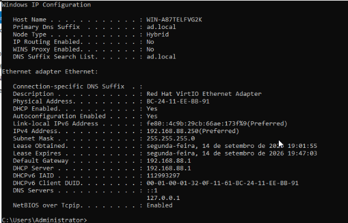
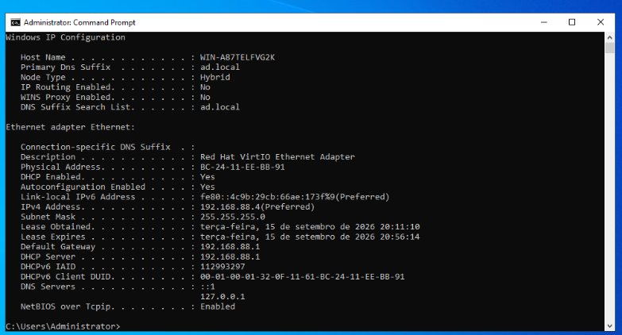
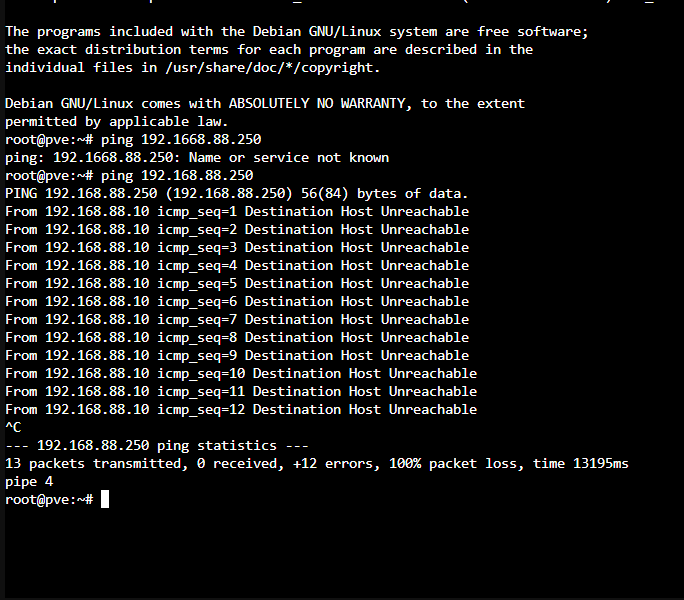

# DHCP Server — Configuração na VM Win-AD (Multi-Role)

> Parte do laboratório Proxmox VE multi-nó em VirtualBox. Documenta a instalação do role **DHCP Server** na mesma VM [Win-AD](./DOC_VM_Win-AD_Active-Directory.md) (servidor multi-role: AD DS + DNS + DHCP), incluindo a migração de rede motivada pela introdução de um roteador Mikrotik no ambiente.

---

## Sumário

- [Contexto](#contexto)
- [Migração de Rede: Introdução do Mikrotik](#migração-de-rede-introdução-do-mikrotik)
- [Instalação do Role DHCP Server](#instalação-do-role-dhcp-server)
- [Divisão de Faixas: Mikrotik e Windows DHCP](#divisão-de-faixas-mikrotik-e-windows-dhcp)
- [Criação do Escopo DHCP no Windows Server](#criação-do-escopo-dhcp-no-windows-server)
- [Instabilidade de IP e Fixação Definitiva da Win-AD](#instabilidade-de-ip-e-fixação-definitiva-da-win-ad)
- [Registro de Erros e Soluções](#registro-de-erros-e-soluções)
- [Notas / Observações Importantes](#notas--observações-importantes)

---

## Contexto

Com o [Active Directory validado](./DOC_VM_Win-AD_Active-Directory.md) (AD DS + DNS) e a [VM cliente](./DOC_VM_Win-Client-01.md) ingressada no domínio com sucesso via configuração manual de DNS, o próximo passo planejado do lab foi instalar o role **DHCP Server** — de forma que novas máquinas na rede recebam automaticamente o DNS correto (apontando para a Win-AD), sem necessidade de configuração manual, replicando o comportamento observado em ambientes corporativos reais.

O DHCP Server foi instalado na **mesma VM Win-AD** (arquitetura multi-role), e não em uma VM dedicada.

---

## Migração de Rede: Introdução do Mikrotik

Durante essa etapa, um roteador **Mikrotik** foi introduzido no ambiente físico, assumindo o papel de roteador/DHCP principal da rede. Isso alterou a faixa de rede de `192.168.2.0/24` (usada em todo o lab até então) para a faixa padrão de fábrica do Mikrotik: **`192.168.88.0/24`**.

**Novo endereçamento da Win-AD (confirmado via `ipconfig /all`):**

| Campo | Valor |
|---|---|
| IPv4 Address | `192.168.88.250` |
| Subnet Mask | `255.255.255.0` |
| Default Gateway | `192.168.88.1` (Mikrotik) |
| DHCP Server (recebido) | `192.168.88.1` |
| DNS Servers | `127.0.0.1` (localhost — a própria Win-AD) |

> Como a VM utiliza rede em modo **Bridge**, ela migrou automaticamente para a nova faixa de rede física assim que o Mikrotik passou a rotear/distribuir DHCP no ambiente, sem necessidade de reconfiguração manual do adaptador.

> **Nota:** `127.0.0.1` como DNS Server é o comportamento padrão e correto para um Domain Controller que hospeda seu próprio DNS — para que **outras máquinas** apontem o DNS para a Win-AD, deve-se usar o IP real dela na rede (`192.168.88.250`), não o localhost.

**Impacto:** a VM cliente ([Win-Client-01](./DOC_VM_Win-Client-01.md)), que tinha DNS configurado manualmente para `192.168.2.19` (IP antigo da Win-AD), precisou ter essa configuração revisada para o novo IP `192.168.88.250`.

---

## Instalação do Role DHCP Server

Via **Server Manager → Manage → Add Roles and Features**, seguindo o mesmo wizard já utilizado para o AD DS:

1. **Tipo de instalação:** `Role-based or feature-based installation`
2. **Seleção do servidor:** Win-AD (mesma VM já em uso)
3. **Seleção de roles:** `DHCP Server` marcado
4. Popup de features dependentes → **Add Features** (ferramentas de gerenciamento DHCP)
5. Instalação concluída
6. Configuração pós-instalação finalizada via notificação da bandeira no Server Manager (**"Complete DHCP configuration"**)

---

## Divisão de Faixas: Mikrotik e Windows DHCP

Para evitar conflito entre dois servidores DHCP ativos na mesma rede (Mikrotik + Windows Server), optou-se por **dividir a faixa de IPs** em vez de desabilitar o DHCP do Mikrotik por completo — abordagem mais simples e sem risco de perda de acesso a outros dispositivos da rede (como o host Proxmox) que já dependiam do DHCP do Mikrotik.

**Ajuste no Mikrotik (via Winbox → IP → Pool):**

| Campo | Valor anterior | Valor ajustado |
|---|---|---|
| Addresses (pool padrão) | `192.168.88.10-192.168.88.254` | `192.168.88.10-192.168.88.99` |

**Faixa reservada para o Windows Server DHCP:** `192.168.88.100` até `192.168.88.200`.

> Essa divisão permite que os dois servidores DHCP operem simultaneamente na mesma rede física sem sobreposição de faixas, eliminando o risco de dois dispositivos diferentes receberem o mesmo IP.

---

## Criação do Escopo DHCP no Windows Server

Via **DHCP Management Console** (`dhcpmgmt.msc`) → botão direito em **IPv4** → **New Scope...**

| Campo | Valor configurado |
|---|---|
| IP inicial | `192.168.88.100` |
| IP final | `192.168.88.200` |
| Máscara de sub-rede | `255.255.255.0` |
| Lease duration | Padrão (8 dias) |
| Gateway padrão (Router) | `192.168.88.1` (Mikrotik) |
| Domain Name | `ad.local` |
| **DNS Servers** | **`192.168.88.4`** (IP definitivo da Win-AD, após fixação — ver seção seguinte) |
| Ativação do escopo | Sim (ativado imediatamente ao final do wizard) |

> **Por que o campo DNS Servers é o mais crítico desta configuração:** é esse valor que resolve, de forma definitiva, a necessidade de configuração manual de DNS em cada nova máquina cliente (conforme já havia sido feito manualmente na Win-Client-01). A partir de agora, qualquer máquina que receba IP via DHCP do Windows Server já recebe automaticamente o DNS apontando para a Win-AD, sem intervenção manual — reproduzindo o comportamento observado em ambientes corporativos reais que possuem essa integração AD + DHCP.

---

## Instabilidade de IP e Fixação Definitiva da Win-AD

Após a criação do escopo, surgiram falhas de conectividade recorrentes: máquinas físicas externas (PC 1 e PC 2, ligados à rede via Mikrotik) e até o próprio host Proxmox não conseguiam alcançar a Win-AD (`ping` retornando "Destination Host Unreachable"), e o escopo DHCP do Windows Server **não distribuía IP algum**, mesmo configurado e ativado corretamente.

### Diagnóstico 1 — IP dinâmico da Win-AD mudando silenciosamente

Investigando a falha de ping, constatou-se que o IP da Win-AD havia mudado de `192.168.88.250` (valor usado na configuração inicial do escopo) para `192.168.88.4`, sem aviso — consequência de ela ainda estar em **DHCP dinâmico** (via Mikrotik) nesta fase. Isso invalidava silenciosamente o valor de DNS Servers configurado no escopo, além de qualquer configuração manual de DNS feita em máquinas clientes.

**Evidência do problema em cascata** — teste de ping a partir do shell do próprio Proxmox, contra o IP antigo (`.250`), retornando "Destination Host Unreachable":

**Correção imediata:** atualização do DNS Servers no escopo para o IP correto (`192.168.88.4`), e criação de uma **reserva de IP por MAC Address** no próprio Mikrotik (`IP → DHCP Server → Leases → Make Static`) para essa VM, na tentativa de estabilizar o endereço.

### Diagnóstico 2 — DHCP Server não distribuía IP mesmo com escopo ativo e correto

Mesmo após corrigir o IP no escopo, novas máquinas (ex: PC 2) não recebiam IP algum do Windows Server DHCP — permanecendo sempre com endereços da faixa do Mikrotik, mesmo após `ipconfig /release` / `renew` repetidos e ajuste do pool do Mikrotik para não ter mais endereços livres (teste de diagnóstico que confirmou que o problema não era apenas "corrida" entre os dois DHCPs).

**Causa raiz identificada:** o serviço DHCP do Windows Server depende de um **Binding (Ligação)** correto e estável a uma interface de rede específica para começar a escutar e responder requisições na rede (`IPv4 → Properties → aba Bindings`). Como o IP da própria Win-AD ainda estava sujeito a mudar dinamicamente (Diagnóstico 1), o binding não conseguia se associar de forma confiável — o serviço ficava instalado e o escopo aparecia ativado, mas o DHCP **não respondia de fato** às requisições da rede.

**Solução definitiva:**
1. **Fixar o IP da Win-AD de forma verdadeiramente estática** (IPv4 configurado manualmente no adaptador de rede da própria VM, não apenas via reserva do DHCP externo do Mikrotik)
2. Com o IP estático aplicado, o Windows passou a permitir refazer corretamente o **Binding** do serviço DHCP àquela interface/IP
3. Após reconfigurar o binding, o serviço DHCP passou a escutar a rede corretamente e a distribuir IPs automaticamente aos clientes, conforme esperado

> **Lição para o lab:** um serviço DHCP hospedado numa VM cujo próprio IP ainda é dinâmico é uma fonte comum de instabilidade — o binding do serviço pode não se manter consistente através de mudanças de IP. Servidores que hospedam DHCP (assim como DNS/AD DS) devem sempre ter **IP verdadeiramente estático**, configurado localmente na própria interface de rede, e não apenas por reserva em um DHCP externo (Mikrotik/roteador).

---

## Registro de Erros e Soluções

### Erro #1 — Ping para a Win-AD falhando em toda a rede ("Destination Host Unreachable")

**Contexto:** após a migração de rede para o Mikrotik, pings partindo do host Proxmox e de máquinas físicas externas para o IP antigo da Win-AD (`192.168.88.250`) falhavam consistentemente.

**Causa:** o IP da Win-AD havia mudado dinamicamente para `192.168.88.4` — o endereço `.250` simplesmente não existia mais em nenhum dispositivo da rede.

**Solução:** identificado o novo IP via `ipconfig /all` na própria Win-AD; todas as referências a `.250` (escopo DHCP, configurações manuais de clientes) foram atualizadas para o IP correto, e a causa raiz (IP dinâmico) foi resolvida na seção anterior.

### Erro #2 — Escopo DHCP do Windows Server ativo, mas não distribuindo IPs

**Contexto:** mesmo com o escopo criado, ativado e com faixa de IPs livre (após redução do pool do Mikrotik para eliminar disputa de faixa), nenhuma máquina cliente conseguia obter IP do Windows Server DHCP.

**Causa:** binding do serviço DHCP inconsistente, decorrente do IP da própria Win-AD ainda ser dinâmico (ver Diagnóstico 2 acima).

**Solução:** fixação de IP estático verdadeiro na Win-AD, seguida de reconfiguração do Binding do serviço DHCP (`IPv4 Properties → Bindings`) para a interface correta.

---

## Notas / Observações Importantes

- Servidor multi-role: esta VM ([Win-AD](./DOC_VM_Win-AD_Active-Directory.md)) acumula os roles **AD DS**, **DNS** e **DHCP**.
- Rede do lab migrada de `192.168.2.0/24` para `192.168.88.0/24` após a introdução do roteador Mikrotik.
- Divisão de faixas ativa: Mikrotik (`88.10`–`88.99`) e Windows DHCP (`88.100`–`88.200`).
- **IP definitivo da Win-AD: `192.168.88.4`, fixado como estático verdadeiro** (não mais dependente de DHCP dinâmico ou de reserva externa) — pendência antiga de fixação de IP finalmente resolvida, e causa raiz da instabilidade do serviço DHCP.
- Pendência secundária: PC 2 foi configurado com IP estático manual (`192.168.88.100`) para validação — pode ser migrado futuramente para IP dinâmico via reserva no Windows Server DHCP, agora que o binding do serviço está estável.
- File Server documentado em [DOC_VM_FileServer.md](./DOC_VM_FileServer.md); Backup em [DOC_VM_Backup-Server.md](./DOC_VM_Backup-Server.md).
