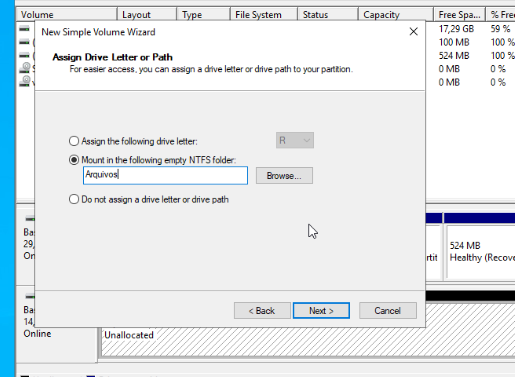

# File Server — Configuração na VM Win-AD (Multi-Role)


> Parte do laboratório Proxmox VE multi-nó em VirtualBox. Documenta a instalação do role **File Server** na mesma VM [Win-AD](./DOC_VM_Win-AD_Active-Directory.md) (servidor multi-role: AD DS + DNS + [DHCP](./DOC_VM_DHCP-Server.md) + File Server), incluindo estrutura de pastas por departamento e permissões NTFS/compartilhamento alinhadas à estrutura de grupos já criada no AD.

---

## Sumário

- [Contexto](#contexto)
- [Segundo Disco Virtual: Adição e Inicialização](#segundo-disco-virtual-adição-e-inicialização)
- [Instalação do Role File Server](#instalação-do-role-file-server)
- [Estrutura de Pastas por Departamento](#estrutura-de-pastas-por-departamento)
- [Permissões: Compartilhamento e NTFS](#permissões-compartilhamento-e-ntfs)
- [Validação de Acesso](#validação-de-acesso)
- [Notas / Observações Importantes](#notas--observações-importantes)

---

## Contexto

Com o [Active Directory](./DOC_VM_Win-AD_Active-Directory.md) e o [DHCP Server](./DOC_VM_DHCP-Server.md) validados e estáveis, o próximo passo do lab foi instalar o role **File Server**, aproveitando a estrutura de grupos de segurança já criada (`TI`, `RH`, `Financeiro`) para implementar uma segregação real de acesso a arquivos por departamento — fechando o ciclo de RBAC iniciado na etapa do AD DS (delegação administrativa) com a aplicação prática em recursos de arquivo.

O File Server foi instalado na **mesma VM Win-AD** (arquitetura multi-role), consolidando quatro roles na mesma máquina: AD DS, DNS, DHCP e File Server.

---

## Segundo Disco Virtual: Adição e Inicialização

Diferente dos roles anteriores, o File Server utiliza um **disco virtual dedicado**, separado do disco de sistema (`C:`) — boa prática para isolar dados de usuário do sistema operacional, facilitando expansão e backup futuros.

### 1. Adição do disco no Proxmox

Via **VM Win-AD → Hardware → Adicionar → Disco Rígido**:

| Parâmetro | Valor |
|---|---|
| Barramento | SCSI (mesmo padrão do disco principal) |
| Storage | local-lvm |
| Tamanho | 20 GB |

### 2. Inicialização dentro do Windows

Via **Gerenciamento de Disco** (`diskmgmt.msc`):

1. Disco detectado como "Não inicializado" → **Inicializar Disco** (GPT)
2. **Novo Volume Simples** no espaço não alocado
3. Letra de unidade atribuída: **`D:`**
4. Formatado como **NTFS**



> **Nota de configuração:** durante o wizard, a opção padrão sugerida foi "Mount in the following empty NTFS folder" (montar como pasta em vez de letra de unidade) — optou-se por reverter para **"Assign the following drive letter"**, mantendo a abordagem mais simples e direta de uma letra de unidade dedicada (`D:`), facilitando a criação de pastas na raiz e o acesso via caminho de rede.

---

## Instalação do Role File Server

Via **Server Manager → Manage → Add Roles and Features**:
- **File and Storage Services → File Server** confirmado/marcado (frequentemente já vem parcialmente instalado por padrão no Windows Server)

---

## Estrutura de Pastas por Departamento

Estrutura criada diretamente na raiz do disco `D:`, espelhando os grupos de segurança já existentes no AD ([ver estrutura organizacional](./DOC_VM_Win-AD_Active-Directory.md#estrutura-organizacional-ous-grupos-e-usuários)):

```
D:\RH
D:\Financeiro
D:\TI
```

---

## Permissões: Compartilhamento e NTFS

Cada pasta recebeu configuração de **compartilhamento (Sharing)** e **permissões NTFS (Security)**, seguindo a mesma lógica: o grupo do próprio departamento com acesso de trabalho (Modify), e o grupo **TI** com controle total em todas as pastas — reflexo direto da delegação administrativa já concedida ao TI sobre RH e Financeiro no Active Directory.

### Matriz de permissões aplicada

| Pasta | Grupo do departamento | Grupo TI |
|---|---|---|
| `D:\RH` | `RH` → **Modify** | `TI` → **Full Control** |
| `D:\Financeiro` | `Financeiro` → **Modify** | `TI` → **Full Control** |
| `D:\TI` | — (pasta exclusiva do grupo) | `TI` → **Full Control** |

**Configuração aplicada em cada pasta (Properties):**

1. **Aba Sharing → Advanced Sharing:**
   - "Share this folder" marcado, nome do compartilhamento igual ao nome da pasta
   - Permissions: grupo do departamento (Change/Modify) e grupo TI (Full Control)
2. **Aba Security:**
   - Edit → Add → grupo correspondente
   - Grupo do departamento: **Modify**
   - Grupo TI: **Full Control**

> **Racional da permissão diferenciada:** o grupo TI recebe Full Control em todas as pastas porque administra a infraestrutura como um todo (criar, mover, deletar arquivos de qualquer departamento, resolver problemas de permissão) — consistente com a [delegação administrativa](./DOC_VM_Win-AD_Active-Directory.md#delegação-de-permissões-administrativas) já concedida a esse grupo no AD. RH e Financeiro recebem apenas Modify, suficiente para o uso diário, sem a necessidade de alterar permissões de terceiros.

---

## Validação de Acesso

Acesso testado via caminho de rede (UNC), a partir de uma máquina ingressada no domínio:

```
\\win-a87telfvg2k\RH
\\win-a87telfvg2k\Financeiro
\\win-a87telfvg2k\TI
```

**Resultado:** listagem de compartilhamentos confirmada (rede e nome do servidor resolvendo corretamente). Acesso validado com sucesso a uma pasta pertencente ao grupo do usuário testado, confirmando a segregação básica de acesso por departamento.

> **Validação completa recomendada (próxima sessão de testes):** confirmar explicitamente que um usuário de um departamento recebe **acesso negado** ao tentar entrar na pasta de outro departamento (ex: `Lucia.Silva`, do grupo RH, tentando acessar `\\servidor\Financeiro`) — e que um usuário do grupo `TI` consegue acessar as três pastas sem restrição.

---

## Notas / Observações Importantes

- Servidor multi-role: esta VM ([Win-AD](./DOC_VM_Win-AD_Active-Directory.md)) acumula os roles **AD DS**, **DNS**, **DHCP** e **File Server**.
- Estrutura de pastas por departamento (`RH`, `Financeiro`, `TI`) no disco `D:`, com permissões de compartilhamento e NTFS espelhando os grupos de segurança do AD.
- Grupo `TI` com Full Control em todas as pastas, alinhado à delegação administrativa já concedida no Active Directory.
- Pendência: validação formal de bloqueio cruzado entre departamentos (ex: RH tentando acessar Financeiro) ainda não documentada com prints — recomendável para fechar a validação com evidência completa.
- Backup desta estrutura documentado em [DOC_VM_Backup-Server.md](./DOC_VM_Backup-Server.md).
