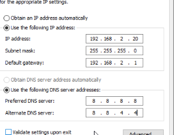
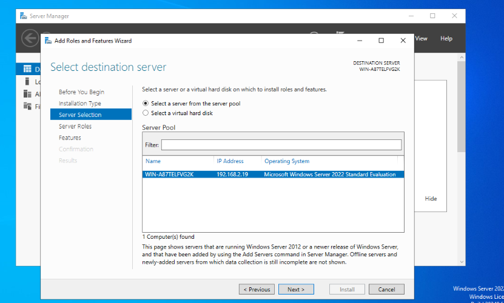
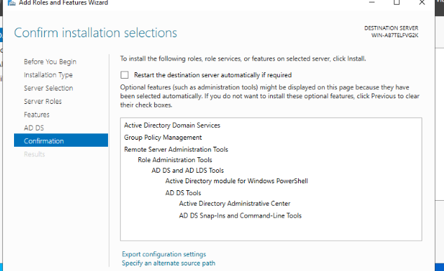
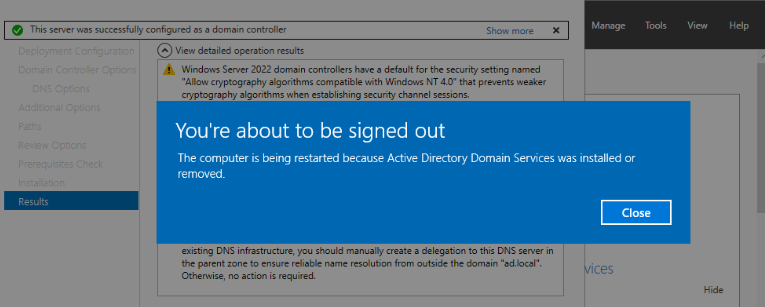
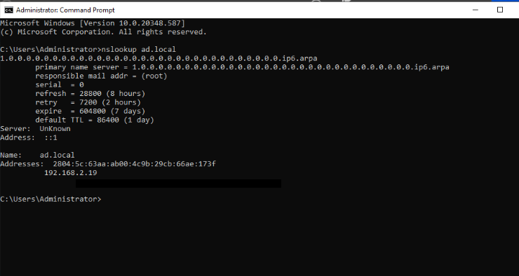
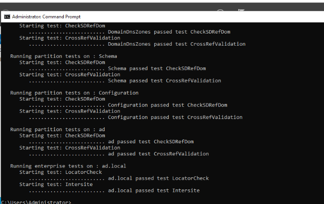
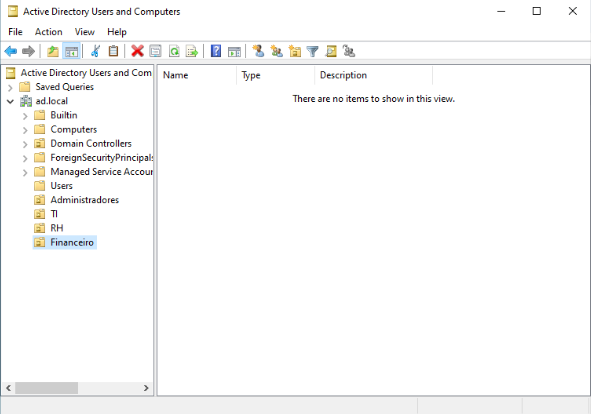
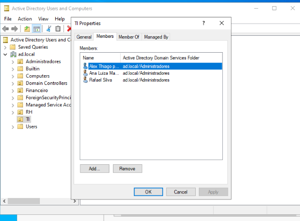
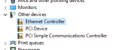
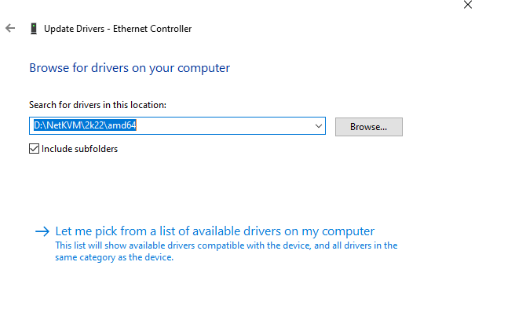

# VM Win-AD — Active Directory Domain Services (AD DS) + DNS


> Parte do laboratório Proxmox VE multi-nó em VirtualBox. Documenta a criação da VM Win-AD, hospedada na [Máquina 2](./DOC_Instalacao_Proxmox_VirtualBox_Maquina2.md), com os roles de **AD DS** e **DNS**. Próximos documentos do lab: **DHCP Server**, **File Server**, **Backup**.

---

## Sumário

- [Contexto](#contexto)
- [Especificações da VM](#1-especificações-da-vm)
- [Criação da VM e Instalação do Windows Server](#criação-da-vm-e-instalação-do-windows-server)
- [Configuração de Rede](#configuração-de-rede)
- [Instalação da Role AD DS](#instalação-da-role-ad-ds)
- [Promoção a Controlador de Domínio](#promoção-a-controlador-de-domínio)
- [Validação Pós-Promoção](#validação-pós-promoção)
- [Estrutura Organizacional: OUs, Grupos e Usuários](#estrutura-organizacional-ous-grupos-e-usuários)
- [Delegação de Permissões Administrativas](#delegação-de-permissões-administrativas)
- [Registro de Erros e Soluções](#registro-de-erros-e-soluções)
- [Referência Rápida de Comandos](#referência-rápida-de-comandos)
- [Notas / Observações Importantes](#notas--observações-importantes)

---

## Contexto

A VM foi planejada para hospedar os roles de **AD DS**, **DNS**, **DHCP** e **File Server**. As configurações de hardware foram definidas priorizando performance de disco e rede via VirtIO, evitando os gargalos comuns de emulação (IDE/E1000).

> ⚠️ **Nota sobre rede:** os IPs e configurações de rede registrados ao longo deste documento (faixa `192.168.2.0/24`) refletem o estado do lab no momento de cada etapa. Posteriormente, a rede foi migrada para `192.168.88.0/24` após a introdução de um roteador Mikrotik — detalhes completos em [DOC_VM_DHCP-Server.md](./DOC_VM_DHCP-Server.md). O IP definitivo e atual da Win-AD é `192.168.88.4`.

---

## 1. Especificações da VM

| Parâmetro | Valor |
|---|---|
| **Nome** | Win-AD |
| **Node** | pve |
| **BIOS** | OVMF (UEFI) |
| **Machine** | q35 |
| **Sistema Operacional** | Microsoft Windows 11/2022/2025 (grupo compatível com Windows Server 2022) |
| **CPU** | 4 cores, 1 socket (x86-64-v2-AES) |
| **Memória** | 5024 MB (5 GB) |
| **Disco principal** | scsi0 — 30 GB — `local-lvm` |
| **Controlador SCSI** | VirtIO SCSI single |
| **Barramento do disco** | SCSI (VirtIO) |
| **IO thread** | Habilitado |
| **Discard** | Desabilitado |
| **Rede (net0)** | VirtIO (paravirtualized), bridge `vmbr0`, firewall habilitado |
| **Disco EFI** | `local-lvm`, 4M, pre-enrolled-keys=1 |

**Justificativa técnica:**
- **Disco em SCSI + Controlador VirtIO SCSI single**: elimina overhead de emulação IDE, entrega performance próxima ao I/O nativo, com suporte a TRIM/Discard e IO thread.
- **Rede em VirtIO**: reduz uso de CPU do host e latência, throughput superior ao modelo emulado Intel E1000.
- **1 socket x 4 cores**: evita overhead de topologia multi-socket desnecessária; host físico possui 8 núcleos/15 threads, então há margem suficiente.
- **5 GB de RAM**: equilíbrio entre desempenho da VM (AD DS + DNS + DHCP + File Server) e RAM total do host físico (16 GB), evitando sobrecarga considerando VirtualBox + Windows anfitrião + demais VMs.

---

## Criação da VM e Instalação do Windows Server

### 2. Desativação da Virtualização de hardware KVM na VM

**Problema:** como o Proxmox está rodando dentro de uma VM do VirtualBox (virtualização aninhada), o host físico não expõe corretamente o VT-x/AMD-V para uso do KVM na VM Win-AD, impedindo o boot/instalação de prosseguir normalmente.

**Solução aplicada:** em `Opções → Virtualização de hardware KVM`, o recurso foi definido como **Não** (desabilitado) para essa VM.

| Parâmetro | Valor |
|---|---|
| Virtualização de hardware KVM | Não |
| Ordem de Boot | scsi0, ide2, net0, ide0 |
| Congelar CPU ao iniciar | Não |
| Suporte ACPI | Sim |
| Usar a hora local para RTC | Padrão (Habilitado para Windows) |

> Com KVM desabilitado, a VM roda em modo de emulação pura de CPU (sem aceleração de hardware), o que é esperado dentro de um ambiente de virtualização aninhada sem suporte completo a nested virtualization no host físico. Isso resolveu o travamento/falha na inicialização da VM.

### 3. Necessidade de criar um CD/DVD dedicado para o driver VirtIO

Como o disco principal foi configurado em barramento **SCSI** com controlador **VirtIO SCSI single**, o instalador do Windows Server não reconhece o disco nativamente — o Windows não possui, por padrão, o driver `vioscsi` embutido. Sem esse driver, a tela de particionamento do instalador não lista nenhum disco disponível.

Por isso, foi **necessário criar uma segunda unidade de CD/DVD** na VM, contendo o ISO `virtio-win-0.1.285.iso`, para que o instalador conseguisse carregar o driver manualmente durante a instalação (opção `Load driver`).

**Criação do CD/DVD (primeira tentativa):**
- `Hardware → Adicionar → CD/DVD Drive`
- Barramento/Dispositivo: `SCSI`, número 1
- Armazenamento: `local`
- Imagem ISO: `virtio-win-0.1.285.iso`

**Sintoma encontrado:** ao tentar carregar o driver durante a instalação, essa unidade de CD/DVD não aparecia na lista de unidades disponíveis (`Browse for Folder`), mesmo corretamente montada no Proxmox.

**Causa raiz:** o CD/DVD do virtio-win foi adicionado em barramento **SCSI** (scsi1). Como o driver SCSI ainda não havia sido carregado pelo instalador (justamente o driver que se tentava carregar através desse CD), o Windows não conseguia enxergar nenhum dispositivo em barramento SCSI — incluindo o próprio CD que continha o driver necessário. Problema de dependência circular ("ovo e galinha").

**Correção — recriação do CD/DVD em barramento IDE:**
1. CD/DVD do virtio-win removido do barramento SCSI
2. Novo CD/DVD Drive criado em `Hardware → Adicionar → CD/DVD Drive`, dessa vez em barramento **IDE**:
   - Barramento/Dispositivo: `IDE`
   - Usar arquivo de imagem de disco CD/DVD (iso)
   - Armazenamento: `local`
   - Imagem ISO: `virtio-win-0.1.285.iso`
3. IDE é reconhecido nativamente pelo instalador do Windows sem necessidade de driver adicional, permitindo a leitura do CD desde o início do boot

> **Nota:** o barramento IDE usado no CD-ROM é exclusivo para a etapa de instalação e não impacta a performance da VM em produção — apenas discos de dados (SCSI/VirtIO) e rede (VirtIO) afetam o desempenho no uso diário.

### 4. Sequência de carregamento do driver

1. Boot pela unidade **UEFI QEMU DVD-ROM** (ISO do Windows Server)
2. Na tela de particionamento, nenhum disco visível (driver SCSI ausente)
3. `Load driver` → navegado até a unidade de CD do virtio-win (agora em IDE)
4. Driver selecionado: **Red Hat VirtIO SCSI pass-through controller (D:\amd64\2k22\vioscsi.inf)** — versão correspondente ao Windows Server 2022
5. Disco `scsi0` (30 GB) reconhecido e disponível para instalação
6. Instalação prosseguida normalmente

### 5. Resultado

VM Win-AD instalada com sucesso, disco e rede em VirtIO, pronta para receber os roles de **AD DS**, **DNS**, **DHCP** e **File Server**.

---

## Configuração de Rede

### 6. Driver de rede VirtIO e configuração de IP

Após a instalação, a interface de rede não obtinha conexão automaticamente, mesmo com a placa VirtIO reconhecida no Proxmox — processo semelhante ao do driver de disco (Erro #1 abaixo), desta vez para o adaptador `NetKVM` (VirtIO Ethernet Adapter).

**Configuração de IP aplicada inicialmente** (IPv4 estático, já que `net0` está em bridge `vmbr0` — mesma rede do host Proxmox):

| Campo | Valor |
|---|---|
| Endereço IP | `192.168.2.20` |
| Máscara de sub-rede | `255.255.255.0` |
| Gateway padrão | `192.168.2.1` |
| DNS preferencial | `8.8.8.8` |
| DNS alternativo | `8.8.4.4` |



> ⚠️ Essa configuração estática apresentou problema de conectividade — ver **Erro #2** abaixo, que trata da resolução completa do problema de rede. A solução adotada por ora foi manter a VM em **DHCP dinâmico** (IP `192.168.2.19` no momento da promoção a DC).

---

## Instalação da Role AD DS

### 7. Instalação da Role AD DS (Active Directory Domain Services)

Com a conectividade de rede resolvida, a instalação da role foi iniciada via **Gerenciador do Servidor → Adicionar Funções e Recursos**.

**Sequência do wizard:**
1. **Tipo de instalação:** `Role-based or feature-based installation` (instalação em servidor único, diferente de `Remote Desktop Services installation`, que é específica para infraestrutura VDI)
2. **Seleção do servidor:** `Select a server from the server pool` — servidor `WIN-A87TELFVG2K`, IP `192.168.2.19` (IP obtido via DHCP), Windows Server 2022 Standard Evaluation



3. **Seleção de roles:** `Active Directory Domain Services` marcado (não confundir com `Active Directory Certificate Services`, que é para PKI/certificados)
4. Popup de features dependentes → **Add Features** (Group Policy Management, Remote Server Administration Tools, AD DS Tools, Active Directory Administrative Center, etc.)
5. **Tela de Features:** nenhuma marcação adicional necessária — apenas confirmar e avançar
6. **Tela de confirmação:** revisão final antes da instalação



> **Nota:** o **DNS Server** não precisa ser marcado manualmente nesta etapa — ele é instalado automaticamente ao promover o servidor a Controlador de Domínio, na etapa seguinte.

---

## Promoção a Controlador de Domínio

### 8. Promoção do servidor a Controlador de Domínio (AD DS Configuration Wizard)

Com a role AD DS instalada, o próprio Gerenciador do Servidor exibiu o aviso para **"Promote this server to a domain controller"**, abrindo o **Active Directory Domain Services Configuration Wizard**.

**Sequência do wizard:**

1. **Deployment Configuration:** `Add a new forest` selecionado (primeira VM do domínio — não havia floresta/domínio existente para adicionar um DC ou domínio filho)
   - **Root domain name:** `ad.local`
2. **Domain Controller Options:**
   - Forest/Domain functional level: `Windows Server 2016` (nível mínimo mais recente, compatível com Server 2022 — sem motivo para reduzir num lab)
   - `Domain Name System (DNS) server` ✅ marcado — instalação automática do DNS junto com a promoção
   - `Global Catalog (GC)` ✅ marcado — necessário no primeiro DC da floresta
   - `Read only domain controller (RODC)` ☐ desmarcado — correto, RODC é usado apenas em DCs secundários de filiais
   - Senha DSRM (Directory Services Restore Mode) definida e guardada separadamente da senha do Administrador
3. **DNS Options:** aviso de que a delegação DNS não pôde ser criada (`A delegation for this DNS server cannot be created because the authoritative parent zone cannot be found`) — **esperado e sem impacto**, já que se trata de uma nova floresta sem DNS pai externo. `Create DNS delegation` mantido desmarcado.
4. **Additional Options:** NetBIOS domain name confirmado como `AD` (derivado de `ad.local`)
5. **Paths:** mantidos os caminhos padrão (`C:\Windows\NTDS` para banco de dados e logs, `C:\Windows\SYSVOL` para SYSVOL)
6. **Prerequisites Check:** `All prerequisite checks passed successfully`, com dois avisos informativos sem impacto na instalação:
   - Compatibilidade de criptografia legada (NT 4.0) — aviso padrão de segurança
   - Adaptador de rede sem IP estático — referente à VM estar em DHCP (ver Erro #2); **não impede a instalação**, apenas recomendação de boas práticas para DCs

**Resultado:**



> ✅ **"This server was successfully configured as a domain controller"** — servidor reiniciado automaticamente ao final do processo, conforme esperado.

> **Pendência registrada:** fixar o IP da VM via reserva DHCP por MAC Address no roteador (ver Erro #2), já que o Prerequisites Check recomendou IP estático para o Domain Controller. Pode ser feito com segurança após a promoção, sem necessidade de reconfigurar tudo do zero — apenas revisar DNS/Netlogon e rodar `ipconfig /registerdns` se necessário.

---

## Validação Pós-Promoção

### 9. Login de domínio e saúde do DC

Após o reboot automático, o login passou a exigir o formato de domínio: **`AD\Administrator`** (em vez do login local usado durante a instalação), confirmando que a promoção alterou corretamente o contexto de autenticação da máquina.

**Verificação do DNS interno:**

```
C:\Users\Administrator>nslookup ad.local
Server:  UnKnown
Address:  ::1

Name:    ad.local
Addresses:  192.168.2.19
```



O domínio resolve corretamente para o IP atual da VM (`192.168.2.19`, via DHCP na rede original — posteriormente migrada, ver nota sobre rede abaixo), e o servidor de nomes utilizado é o próprio localhost (`::1`) — confirmando que a VM já está usando a si mesma como DNS, como esperado após a promoção a Controlador de Domínio.

**Verificação de saúde do Domain Controller (`dcdiag`):**

```
Running partition tests on : DomainDnsZones
   Starting test: CheckSDRefDom
      ......................... DomainDnsZones passed test CheckSDRefDom
   Starting test: CrossRefValidation
      ......................... DomainDnsZones passed test CrossRefValidation

Running partition tests on : Schema
   Starting test: CheckSDRefDom
      ......................... Schema passed test CheckSDRefDom
   Starting test: CrossRefValidation
      ......................... Schema passed test CrossRefValidation

Running partition tests on : Configuration
   Starting test: CheckSDRefDom
      ......................... Configuration passed test CheckSDRefDom
   Starting test: CrossRefValidation
      ......................... Configuration passed test CrossRefValidation

Running partition tests on : ad
   Starting test: CheckSDRefDom
      ......................... ad passed test CheckSDRefDom
   Starting test: CrossRefValidation
      ......................... ad passed test CrossRefValidation

Running enterprise tests on : ad.local
   Starting test: LocatorCheck
      ......................... ad.local passed test LocatorCheck
   Starting test: Intersite
      ......................... ad.local passed test Intersite
```



Todos os testes de partição (DomainDnsZones, Schema, Configuration, ad) e testes de floresta/enterprise (LocatorCheck, Intersite) retornaram **`passed test`**, confirmando que o Domain Controller está funcionalmente saudável.

---

## Estrutura Organizacional: OUs, Grupos e Usuários

Com o Domain Controller validado, a etapa seguinte foi estruturar Unidades Organizacionais (OUs), grupos de segurança e usuários de teste, simulando um cenário corporativo básico com áreas distintas (TI, RH, Financeiro) e controle administrativo delegado.

### 1. Criação das Unidades Organizacionais (OUs)

Via **Active Directory Users and Computers (ADUC)** — `dsa.msc` — foram criadas 4 OUs no domínio `ad.local`:

| OU | Finalidade |
|---|---|
| `Administradores` | Contas com maior privilégio (TI/Admins) |
| `TI` | Grupo de segurança do time de TI |
| `RH` | Área de Recursos Humanos |
| `Financeiro` | Área Financeira |



> Todas criadas com a opção padrão **"Protect container from accidental deletion"** mantida marcada.

### 2. Criação dos Grupos de Segurança

Um grupo de segurança foi criado dentro de cada OU correspondente, com as seguintes configurações:

| Parâmetro | Valor |
|---|---|
| Group scope | `Global` |
| Group type | `Security` |

**Grupos criados:** `TI`, `RH`, `Financeiro`, `Admins` (dentro da OU Administradores).

> **Global + Security**: Security é o tipo necessário para carregar permissões (Distribution serve apenas para listas de e-mail). Global é o scope correto para organizar usuários dentro de um único domínio — Domain Local e Universal se aplicam a cenários multi-domínio/floresta, fora do escopo deste lab.

### 3. Criação dos Usuários

5 usuários de teste foram criados (padrão de logon `primeiro.ultimo`), distribuídos pelos grupos:

| Grupo(s) | Usuário |
|---|---|
| **Admins + TI** | Rafael.Silva |
| **Admins + TI** | Ana.Luiza |
| **Admins + TI** | Alex.Thiago |
| **RH** | Lucia.Silva |
| **Financeiro** | Sandra.Lorena |

Todos criados com senha temporária e a opção **"User must change password at next logon"** marcada.

> **Nota importante:** estar na mesma OU de um grupo **não torna o usuário membro desse grupo** — são objetos independentes. A associação a um grupo exige a ação explícita **botão direito no usuário → "Add to a group..."**. Essa confusão ocorreu durante a montagem do lab e está detalhada no registro de erros abaixo.

**Confirmação de associação múltipla:** Rafael.Silva, Ana.Luiza e Alex.Thiago foram criados na OU `Administradores`, e adicionados manualmente também como membros do grupo `TI` — demonstrando que um mesmo usuário pode pertencer a múltiplos grupos simultaneamente (multi-associação).



---

## Delegação de Permissões Administrativas

Para simular um cenário real de suporte técnico com poder limitado (RBAC — Role-Based Access Control), o grupo **TI** recebeu controle administrativo delegado sobre as OUs **RH** e **Financeiro**, via **Delegation of Control Wizard**.

### Procedimento (repetido para as OUs RH e Financeiro)

1. Botão direito na OU → **Delegate Control...**
2. **Users or Groups** → Add → `TI` → Check Names → OK
3. **Tasks to Delegate** → tarefas comuns marcadas:
   - ✅ Create, delete, and manage user accounts
   - ✅ Reset user passwords and force password change at next logon
   - ✅ Create, delete and manage groups
   - ✅ Modify the membership of a group
4. Confirmação final revisada e wizard finalizado

**Resultado da delegação (OU RH):**

```
You chose to delegate control of objects in the following Active Directory folder:
  ad.local/RH
The groups, users, or computers to which you have given control are:
  TI (AD\TI)
```

O mesmo processo foi repetido integralmente para a OU **Financeiro**, delegando ao grupo `TI` o mesmo conjunto de tarefas sobre `ad.local/Financeiro`.

> **Resultado prático:** membros do grupo `TI` (Rafael.Silva, Ana.Luiza, Alex.Thiago) agora podem criar/gerenciar contas de usuário, resetar senhas e gerenciar grupos dentro das OUs **RH** e **Financeiro** — sem possuir privilégios de Domain Admin sobre o restante do domínio. Essa é uma prática comum de segurança: delegar apenas o escopo necessário, em vez de conceder controle total do domínio para tarefas operacionais do dia a dia.

---

## Registro de Erros e Soluções

### Erro #1 — CD/DVD do driver VirtIO não aparece durante a instalação do Windows

**Contexto:** ocorreu durante a instalação do Windows Server na VM Win-AD, ao tentar carregar o driver `vioscsi` (necessário porque o disco principal usa controlador VirtIO SCSI single) através de um segundo CD/DVD virtual.

**Causa:** o CD/DVD do `virtio-win-0.1.285.iso` foi criado em barramento **SCSI** (scsi1). Como o driver SCSI ainda não havia sido carregado pelo instalador — justamente o driver que se tentava obter através desse CD —, o Windows não conseguia enxergar nenhum dispositivo em barramento SCSI, incluindo o próprio CD com o driver necessário. Dependência circular ("ovo e galinha").

**Solução:** remover o CD/DVD do barramento SCSI e recriá-lo em barramento **IDE** (`Hardware → Adicionar → CD/DVD Drive → IDE`, imagem `virtio-win-0.1.285.iso`). IDE é reconhecido nativamente pelo instalador sem necessidade de driver adicional, permitindo a leitura do CD desde o início do boot. O barramento IDE é usado apenas durante a instalação e não afeta a performance da VM em produção.

### Erro #2 — VM Win-AD não inicializa com KVM habilitado

**Contexto:** ocorreu ao tentar dar boot na VM Win-AD pela primeira vez, dentro do Proxmox (que por sua vez roda dentro de uma VM VirtualBox no host Windows).

**Causa:** virtualização aninhada (nested virtualization) — o host físico não expõe corretamente o VT-x/AMD-V para uso do KVM dentro da VM Win-AD, impedindo o boot/instalação de prosseguir normalmente.

**Solução:** desabilitar a **Virtualização de hardware KVM** da VM em `Opções → Virtualização de hardware KVM → Não`. A VM passa a rodar em emulação pura de CPU (sem aceleração de hardware), o que resolve o travamento — trade-off esperado em ambiente de nested virtualization sem suporte completo no host físico.

### Erro #3 — Rede sem internet: driver VirtIO Ethernet ausente

**Contexto:** após a instalação do Windows Server na VM Win-AD, `Configurações → Rede e Internet → Conexões de Rede` aparecia vazio (0 itens) — nenhum adaptador de rede era exibido, mesmo com `net0` configurado como VirtIO no Proxmox.

**Diagnóstico:** verificado no **Gerenciador de Dispositivos**, que confirmou a causa — os componentes de rede apareciam em **"Outros dispositivos"** sem driver instalado: `Ethernet Controller`, `PCI Device` e `PCI Simple Communications Controller`.



**Causa:** mesmo problema já visto com o disco (Erro #1) — o Windows Server não possui, por padrão, o driver `NetKVM` (VirtIO Ethernet Adapter) embutido. Sem esse driver, o adaptador de rede virtual não é reconhecido pelo sistema operacional, mesmo estando corretamente configurado no Proxmox.

**Solução:**
1. CD/DVD do `virtio-win-0.1.285.iso` já estava montado em barramento IDE (reaproveitado do Erro #1), disponível como unidade `D:` (`CD Drive (D:) virtio-win-0.1.285`)
2. No Gerenciador de Dispositivos, clicar com botão direito em `Ethernet Controller` → **Atualizar driver** → **Procurar driver no computador**
3. Informar o caminho: `D:\NetKVM\2k22\amd64` (driver correspondente ao Windows Server 2022, arquitetura 64-bit)



4. Instalar o driver **Red Hat VirtIO Ethernet Adapter**
5. Adaptador de rede passa a ser reconhecido em Conexões de Rede **sem necessidade de reiniciar a VM**, permitindo a configuração manual de IP/gateway/DNS

### Erro #4 — Rede sem conectividade mesmo após driver instalado e IP estático configurado

**Contexto:** após instalar o driver VirtIO Ethernet (Erro #3) e configurar IP estático (`192.168.2.20/24`, gateway `192.168.2.1`) na VM Win-AD, o `ping` no gateway retornava `Destination host unreachable` — nenhum pacote saía da VM.

**Diagnóstico 1 — Modo Promíscuo no VirtualBox:** como o Proxmox roda dentro de uma VM VirtualBox em bridge, e a VM Win-AD roda dentro do Proxmox também em bridge, o tráfego passa por duas camadas de bridge aninhadas. Por padrão, o adaptador de rede do VirtualBox bloqueia pacotes com MAC de origem diferente da MAC da própria VM (proteção padrão contra spoofing), a não ser que o **Modo Promíscuo** esteja habilitado.

**Solução 1:** na VM do **Proxmox** (não a Win-AD, que não existe pro VirtualBox) → **Configurações → Rede → Adaptador → Avançado → Modo Promíscuo → Permitir Tudo**. Após essa mudança, o ping deixou de retornar "host unreachable" e passou a "Request timed out" — sinal de que o pacote já saía da VM, mas ainda sem resposta do gateway.

**Diagnóstico 2 — Roteador físico rejeitando IP estático:** com o modo promíscuo corrigido, ainda faltava resposta do gateway. Teste de troca temporária do IP estático para **DHCP** (`Obter um endereço IP automaticamente`) resolveu imediatamente — a VM recebeu IP via DHCP do roteador físico e passou a ter conectividade completa (gateway e internet).

**Causa raiz:** o roteador físico da rede estava rejeitando o tráfego do IP estático configurado manualmente (`192.168.2.20`), por não ter sido esse IP distribuído por ele via DHCP — comportamento comum em roteadores domésticos com proteção contra IPs "não autorizados"/DHCP snooping.

**Solução 2 (adotada por ora):** manter a VM Win-AD em **DHCP dinâmico**, evitando IP estático manual até avaliar uma reserva de IP fixo (por MAC Address) diretamente no painel do roteador — abordagem recomendada para um futuro Controlador de Domínio, mas não aplicada nesta etapa.

> **Nota:** para um Active Directory Domain Controller, o ideal a médio prazo é ter IP fixo e previsível (via reserva DHCP por MAC ou IP estático autorizado no roteador), já que DNS e clientes do domínio dependem de um endereço estável para o DC. Ficou registrado como pendência para revisão futura.

---

## Referência Rápida de Comandos

```powershell
# Verificar resolução DNS do domínio (dentro da VM Win-AD)
nslookup ad.local

# Verificar saúde geral do Domain Controller
dcdiag

# Forçar re-registro de registros DNS dinâmicos (útil após mudança de IP)
ipconfig /registerdns
```

---

## Notas / Observações Importantes

- Esta VM faz parte do laboratório hospedado na [Máquina 2](./DOC_Instalacao_Proxmox_VirtualBox_Maquina2.md) do Proxmox VE.
- Domínio criado: `ad.local` (NetBIOS: `AD`). Login de administração: `AD\Administrator`.
- **IP definitivo da VM: `192.168.88.4`, fixado como estático** — rede migrada de `192.168.2.0/24` para `192.168.88.0/24` após introdução de um roteador Mikrotik (detalhes em [DOC_VM_DHCP-Server.md](./DOC_VM_DHCP-Server.md)).
- Estrutura organizacional: 4 OUs (`Administradores`, `TI`, `RH`, `Financeiro`), 4 grupos de segurança (Global/Security), 5 usuários de teste, com delegação administrativa do grupo `TI` sobre as OUs `RH` e `Financeiro`.
- Senhas temporárias dos usuários de teste não foram incluídas neste documento por segurança — todas configuradas com troca obrigatória no primeiro login.
- Validação de ponta a ponta realizada com sucesso: ver [DOC_VM_Win-Client-01.md](./DOC_VM_Win-Client-01.md), documentando o ingresso de uma VM cliente no domínio e login com o usuário `Rafael.Silva`.
- Servidor evoluiu para multi-role: ver [DOC_VM_DHCP-Server.md](./DOC_VM_DHCP-Server.md), [DOC_VM_FileServer.md](./DOC_VM_FileServer.md) e [DOC_VM_Backup-Server.md](./DOC_VM_Backup-Server.md).
- Lab concluído: Proxmox → AD DS/DNS → DHCP → File Server → Backup.
